+++
title = "Review of Continual Learning at CVPR'20"
blog = true

date = 2020-06-21
draft = false

hidden = false
authors = []

tags = []
summary = "Review of Continual Learning at CVPR'20"

thumbnail = "202006181738.png"

[header]
image = ""
caption = ""

toc = true
+++

I review in this article, papers published at CVPR 2020 about Continual Learning. If you think I made a mistake or miss an important paper, please tell me!

{}

## 1. Few-Shots

Many papers this year in Continual Learning were about few-shot learning. Besides the CVPR papers I'll present, there is also a workshop paper (*Cognitively-Inspired Model for Incremental Learning Using a Few Examples, Ayub et al. CVPR Workshop 2020*) and an arXiv (*Defining Benchmarks for Continual Few-Shot Learning, Antoniou et al. arxiv:2004.11967*).

### 1.1. Few-Shot Class-Incremental Learning

**PDF**: [2004.10956](https://arxiv.org/abs/2004.10956)\\
**Authors**: Xiaoyu Tao, Xiaopeng Hong, Xinyuan Chang, Songlin Dong, Xing Wei, Yihong Gong

*Tao et al.* proposes in this paper a mix between Few-Shot and Continual Learning. They benchmark their model ---TOPIC-- on the CIFAR100, miniImageNet, and CUB200. The first task is large (60 classes for CIFAR100), then the following tasks have few classes (5 'n-way') and few training samples per class (5 'k-shots').

The author uses **Neural Gas** (*Martinetz et al. 1991*) and **Competitive Hebbian Learning** (*Martinetz, 1993*). This neural network seems similar to the Self-Organizing Maps.

The Neural Gas is an undirected graph, where each node $j$, is defined as $(m_j, \Lambda_j, z_j, c_j)$:
- $m_j$ is a centroid vector, similar to what we can expect after a K-Means (kNN for CL)
- $\Lambda_j$ is the variance matrix of each dimension of the vector
- $z_j$ and $c_j$ are respectively the assigned images and labels

The graph is created after the first task, once the features extractor has been trained. They sample 400 features randomly among the training samples and use them as initial centroids.

Nodes are updated by some kind of moving average (Eq.3 of the paper), where all centroids go towards the incoming sample. The move in the latent space is weighted by a learning rate and more importantly by the L2 distance rank: close features will affect more the centroid than far features.

To create the edges between nodes, they use Competitive Hebbian Learning. Hebbian Learning in Neuroscience stipulates that:

> Neurons that fire together, wire together

In this case, if two nodes are respectively the closest and second closest nodes to an input features, an edge is created. The edge has an age that is incremented each time no "firing together" happened. Past an age threshold, the edge is removed.

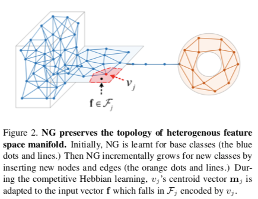

The model is trained with a usual softmax+cross-entropy but the competitive Hebbian learning is done after each step. Note that the latter doesn't produce gradients for backpropagation.

Finally, the inference is not really explained but I guess that each node has a "label" by voting which training sample labels were most associated with. Given a test input sample, its label is determined by the label of its closest node.

They **stabilize** the training by constraining the centroids to stay close to their previous position with a loss they called "anchor loss". It's actually a Mahalanobis loss, where the distance is weighted per dimension with the inverse of the variance (i.e. precision).

They also add a **regularization** called "min-max loss" to separate new centroids (added with new tasks) from previous centroids. It is similar to the hinge loss used by *Hou et al. 2019*.

### 1.2. Incremental Few-Shot Object Detection

**PDF**: [2003.04668](https://arxiv.org/abs/2003.04668)\\
**Authors**: Juan-Manuel Perez-Rua, Xiatian Zhu, Timothy Hospedales, Tao Xiang

*Perez-Rua et al.* propose to use together three settings: Continual Learning, Object Detection (aka finding object boxes in an image), and Few-Shot (with few training samples).

Their setting is made of a first large task, with many classes & data, then the following tasks add new classes with only 10 labeled examples per class (10 k-shots). This is impressive because object detection is harder than classification!

During the first task, they train a **CenterNet**. Similar to CornerNet, class-agnostic features are extracted by a ResNet then class-specific heatmaps are generated. The most active zones are chosen to be boxes' centers. Two additional heads regress the boxes' width and height.

Once their CenterNet has been trained on the base classes, they train a Meta-Learning-based generator. This module must learn to produce the "class-codes", aka the class-specific weights used by the detector. To do so, they train the generator on the base classes split into episodes. All weights are frozen except the generator's.

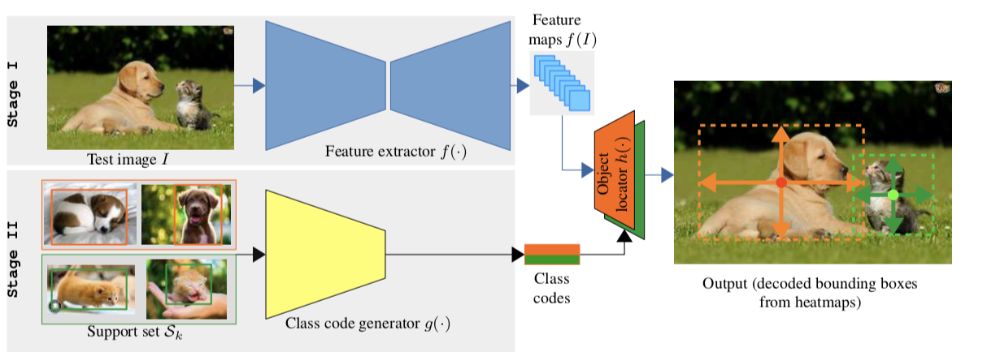

For the following tasks, there is no training. Given a new class, the meta-generator produces on-the-fly new weights, and the inference is immediately done.

It's worth noting that the results on novel classes are quite low:

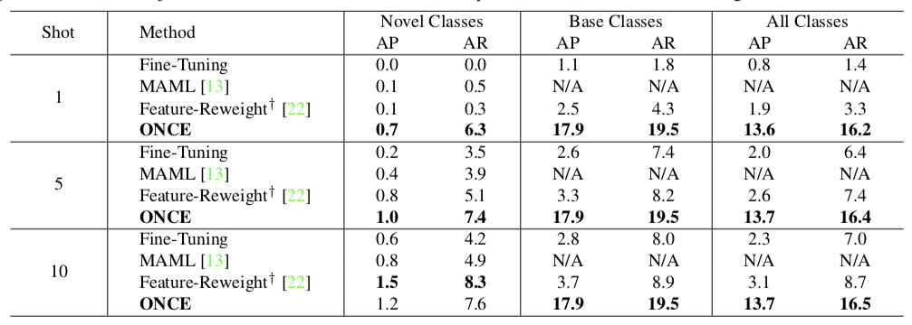

## 2. Conditional Channel Gated Networks for Task-Aware Continual Learning

**PDF**: [2004.00070](https://arxiv.org/abs/2004.00070)\\
**Authors**: Davide Abati, Jakub Tomczak, Tijmen Blankevoort, Simone Calderara, Rita Cucchiara, Babak Ehteshami Bejnordi

*Abati et al.* propose an interesting view of sub-networks in Continual Learning. Previous methods proposed to learn sub-networks inside a unique network (think Lottery Ticket Hypothesis ([Frankle & Carbin, 2018](https://arxiv.org/abs/1803.03635))). Those sub-networks can be learned by an evolutionary algorithm ([Fernando et al., 2017](https://arxiv.org/abs/1701.08734)), L1 sparsity ([Golkar et al., 2019](https://arxiv.org/abs/1903.04476)), or learned gating ([Hung et al., 2019](https://arxiv.org/abs/1910.06562)). However they all have a major constraint: they need the task id in inference to choose the right sub-networks, a setting called Multi-Head Evaluation. Having the task id in inference makes the problem much easier, and I think it is not realistic.

The authors propose to train sub-networks with learned gating. The right sub-network will be chosen inference with a Task Classifier, therefore they don't use the task id! To the best of my knowledge, they are only the second to do this ([von Oswald et al. 2020](https://openreview.net/forum?id=SJgwNerKvB)).

Each residual block of their ResNet has $T$ (number of tasks) gate networks that choose the which filters to enable or disable:

The selection of filters to pass or block is discrete and thus non-differentiable. Thus they use the Gumbel Softmax Sampling similarly to ([Guo et al. 2019](https://arxiv.org/abs/1811.08737)). The forward pass is discrete, but the backward pass is continuous. After each task, they record on a validation set which gates have fired. Their associated filters will be frozen for the following tasks, but still usable!

The interesting part of this paper is how they train the task classifier. During training, all gates are fired in parallel:

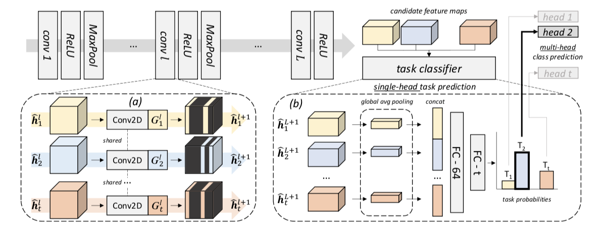

This means that given a single input image, they have $T$ parallel stream of activations. All those streams' outputs are concatenated and fed to a task classifier (a two layers MLP) that classifies the task id. This task id will then be used to chose the right stream to give to the task-specific classifier.

I really like this method, however, it's unfortunate that they don't compare their model to the lastest SotA and on large-scale datasets. Their largest dataset is ImageNet-50. Furthermore, I would like to see which gates fire the most, early layers or later layers?...

## 3. Incremental Learning in Online Scenario

**PDF**: [2003.13191](https://arxiv.org/abs/2003.13191)\\
**Authors**: Jiangpeng He, Runyu Mao, Zeman Shao, Fengqing Zhu

*He et al.* claim to learn in an "Online Scenario": new classes are added as usual, with also old classes new samples. This sounds similar to the **New Instances and Classes** (NIC) ([Lomonaco et al., 2017](http://proceedings.mlr.press/v78/lomonaco17a.html)). They claim novelty while it's not really true (on top of my head, Aljundi et al. and Lomonaco et al. have worked on this).

The authors propose two contributions: first of all they use at first a **Nereast Class Mean** (NCM) (kNN for CL) classifier. Similar to iCaRL's NME, class means are computed. To handle concept drift, they update the means for new samples with a moving average:

$$\mu\_{y}^{\phi} \leftarrow \frac{n\_{y i}}{n\_{y i}+1} \mu\_{y}^{\phi}+\frac{1}{n\_{y i}+1} \phi\left(\mathbf{x}\_{i}\right)$$

Furthermore, during the early tasks, they use in inference their NCM classifier because they remark that it behaves well with data scarcity. When the model is better trained, having seen enough samples, they switch their classifier for the class probabilities from a softmax. It's interesting to mix those inference classifiers (classification and metric-based) contrary to [Hou et al., 2019](http://openaccess.thecvf.com/content_CVPR_2019/papers/Hou_Learning_a_Unified_Classifier_Incrementally_via_Rebalancing_CVPR_2019_paper.pdf) and [Douillard et al., 2020](https://arxiv.org/abs/2004.13513) that evaluated separately the two methods. However *He et al.*'s switch from one method to the other is an hyperparameter, it would have been nice to do so based on some Uncertainty measure.

Their second contribution is a **modified cross-distillation**: in addition of an usual distillation loss on probabilities with temperature ([Hinton et al., 2015](https://arxiv.org/abs/1503.02531)), they modify the classification loss. It is still a cross-entropy but the probabilities associated to old classes are a linear combination of the old and new model outputs:

$$\tilde{p}^{(i)}=\left\\{\begin{array}{cc}\beta p^{(i)}+(1-\beta) \hat{p}^{(i)} & 0 \lt i \leq n \\\\\\ p^{(i)} & n \lt i \leq n+m\end{array}\right.$$

They also finetune their model on a balanced set like [Castro et al., 2018](https://arxiv.org/abs/1807.09536) did.

Finally, they evaluate their model on CIFAR100, ImageNet100, and Food-101. Unfortunately, they evaluate their "Online" NIC setting only on Food-101 and solely compare against a simple baseline, not any SotA models (adapted to the setting). CIFAR100 and ImageNet100 are evaluated in the classic NC setting. They have slightly better performance than SotA on the former and are equivalent to BiC on the latter. I'm quite annoyed that they claimed in the abstract to "out-perform" SotA on ImageNet1000 while they actually only evaluate on the smaller-scale ImageNet100. BiC really shines on ImageNet1000, I'd have liked to see how their model fares in this harsher dataset.

## 4. iTAML: An Incremental Task-Agnostic Meta-learning

**PDF**: [2003.11652](https://arxiv.org/abs/2003.11652)\\
**Authors**: Jathushan Rajasegaran, Salman Khan, Munawar Hayat, Fahad Shahbaz Khan, Mubarak Shah

*Rajasegaran et al.* propose to a novel Meta-Learning model. Several approaches exist using this branch of methods for Continual Learning, they are however the first to the best of my knowledge to do so without task id in inference.

The goal of Meta-Learning is to "learn to learn". In this case, they want to obtain a network that learns to produce a set of parameters that can then be tuned quickly to a particular task. Following existing Meta-Learning models, they train in two loops. The inner loop learns an actual task, while the outer loop learns to produce a good initialization for the inner loop (i.e. "learn to learn"). Inspired by Reptile ([Nichol et al., 2018](https://arxiv.org/abs/1803.02999)), their outer loop is trained on the difference between the base parameters and the parameters learned after the inner loop. The different with Reptile is that the inner loop learns separately each task, producing mean inner loop parameters:

$$\Phi=\Phi\_{b a s e}-\eta \frac{1}{t} \sum\_{i=1}^{t}\left(\Phi\_{b a s e}-\Phi\_{i}\right)=\eta \frac{1}{t} \sum\_{i=1}^{t} \Phi\_{i}+(1-\eta) \Phi\_{b a s e}$$

This forces the meta-model to find a set of parameters good for all tasks:

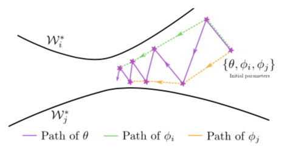

During inference, they proceed in two steps: finding the task id, and then tuning the model for this task. To find the task id, they record for the test subset which task predictions are the most activated in average, and choose the maximum value:

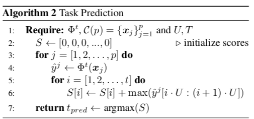

Then, given the predicted task id, they sample all exemplars memory (aka Rehearsal Learning) belonging to this task and learn in a single inner loop task-specific parameters. The resulting model is then used to classify the test samples.

Note that while it's a very interesting approach, their model stands on the quality of the task classification. They claim it's almost 100% accuracy but it only for a reason: in their setting, the model is evaluated on each seen task separately. In a real setting, samples from different tasks are mixed together. There their algorithm 2 won't work. Therefore I don't think this model is truly "task-agnostic" but it's definitely a good step forward.

They evaluate various models, from meta-learning to continual learning domains, on MNIST, SVHN, CIFAR100, ImageNet100, ImageNet1000, and Celeb-10k. It's a bit strange however that BiC (a very good alternative for large scale datasets) is evaluated on Celeb-10k but not ImageNet100 (where it would have beaten iTAML).

## 5. Modeling the Background for Incremental Learning

**PDF**: [2002.00718](https://arxiv.org/abs/2002.00718)\\
**Authors**: Fabio Cermelli, Massimiliano Mancini, Samuel Rota Bulò, Elisa Ricci, Barbara Caputo

*Cermelli et al.* attacks the problem of Semantic Segmentation for Continual Learning. In semantic segmentation, the goal is to give a class to each pixel. Two cars next to each other will have the same pixels labels. This is particularly difficult in Continual Learning for the same reasons as Object Detection: at task $t$, the class "car" may be a background, but then at task $t+1$ we have to predict it. However, our model may have seen images containing cars in the first task and thus has learned to not detect those. Likewise, images from task $t+1$ may be annotated so that the "person" learned previously is now part of the background.

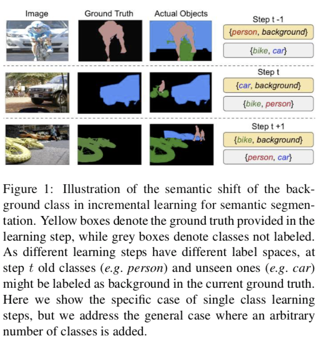

To solve the problem mentionned before, they revisit both the cross-entropy and distillation losses. The former is split in two part: if the pixel probability belongs to the current task's set of classes it is kept unchanged. Otherwise, it is the probability of having **either an old class or the background**:

$$\begin{array}{l}\qquad \ell\_{c e}^{\theta^{t}}(x, y)=-\frac{1}{|\mathcal{I}|} \sum\_{i \in \mathcal{I}} \log \tilde{q}\_{x}^{t}\left(i, y\_{i}\right) \\\\\\ \text { where: } \\\\\\ \qquad \tilde{q}\_{x}^{t}(i, c)=\left\\{\begin{array}{ll}q\_{x}^{t}(i, c) & \text { if } c \neq \mathrm{b} \\\\\\ \sum\_{k \in \mathcal{Y}^{t-1}} q\_{x}^{t}(i, k) & \text { if } c=\mathrm{b}\end{array}\right.\end{array}$$

Likewise, the distillation loss is changed if the pixel belongs to the background, according to the current task, to the probability of having **either a new class or the background**:

$$\ell\_{k d}^{\theta^{t}}(x, y)=-\frac{1}{|\mathcal{I}|} \sum\_{i \in \mathcal{I}} \sum\_{c \in \mathcal{V} t-1} q\_{x}^{t-1}(i, c) \log \hat{q}\_{x}^{t}(i, c)$$

$$\hat{q}\_{x}^{t}(i, c)=\left\\{\begin{array}{ll}q\_{x}^{t}(i, c) & \text { if } c \neq \mathrm{b} \\\\\\ \sum\_{k \in \mathcal{C}^{t}} q_{x}^{t}(i, k) & \text { if } c=\mathrm{b}\end{array}\right.$$

This handles the case where the previous model considers a current pixel as background while the current model considers it as a new class.

Finally, the classifier weights for new classes are initialized with the background weight.

## 6. ADINET: Attribute Drive Incremental Network for Retina Image Classification

**PDF**: [CVPR webpage](http://openaccess.thecvf.com/content_CVPR_2020/papers/Meng_ADINet_Attribute_Driven_Incremental_Network_for_Retinal_Image_Classification_CVPR_2020_paper.pdf)\\
**Authors**: Qier Meng, Satoh Shin'ichi

*Meng and Shin'ichi* use Continual Learning for retinal images classification. They found that retinal diseases have a large variety of types and that current methods didn't allow them to train incrementally each type a new patient came in.

Their originality lies in their usage of attributes. Retinal images have been annotated with a disease label ("AMD", "DR"...) but also with several attributes ("hermorrhage", "macular edema"...). Therefore in addition to the classic distillation loss with temperature scaling applied to the disease prediction, they also distill the attributes prediction of the previous model with a BCE.

In addition to the two distillation losses, they also refine their attributes prediction with a "weight estimation". It measures how much of a contribution an attribute has to distinguish classes. It's similar to doing a self-attention on all attributes to find which one is the most important. This weight estimation is then used to ponder the attribute predictions. They didn't detail much the rationale behind this weight estimation but empirical results show small but consistent gains.

They evaluate both medical and academic datasets. For the later they used ImageNet-150k-sub: it contains 100 classes of ImageNet1000, but only 150 training images were selected per class instead of ~1200. I've never seen a model evaluated on this dataset, but it looks like a more challenging dataset than ImageNet100. They display a significant improvement over the 2017's iCaRL.

It's interesting to predict attributes in the context of Continual Learning. I hypothesize that it forces the model to learn fine-grained features common to all tasks and may reduce catastrophic forgetting.

## 7. Semantic Drift Compensation for Class-Incremental Learning

**PDF**: [2004.00440](https://arxiv.org/abs/2004.00440)\\
**Authors**: Lu Yu, Bartłomiej Twardowski, Xialei Liu, Luis Herranz, Kai Wang, Yongmei Cheng, Shangling Jui, Joost van de Weijer

*Rebuffi et al., 2017* uses class means with a k-NN to classify samples in inference. Those class means are updated after each task by re-extracting features of rehearsal samples of old classes with the new ConvNet. This supposes that we have access to previous data, at least in a limited amount.

*Yu et al.* propose to update the class means without even using previous data. First, they compute the embedding drift between the start and the end of the current task on current data:

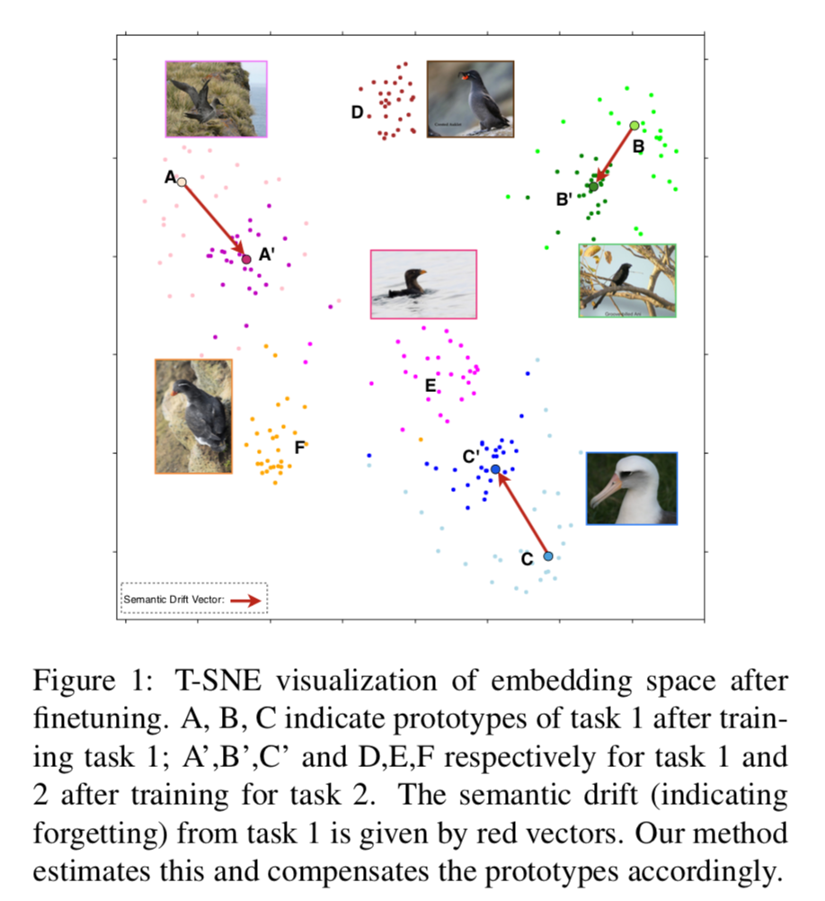

$$\boldsymbol{\delta}\_{i}^{t-1 \rightarrow t}=\mathbf{z}\_{i}^{t}-\mathbf{z}\_{i}^{t-1}, y\_{i} \in C^{t}$$

Then for each old classes, they compute the mean vector of drift:

$$\begin{array}{c}\hat{\Delta}\_{c^{s}}^{t-1 \rightarrow t}=\frac{\sum\_{i}\left[y\_{i} \in C^{t}\right] w\_{i} \delta\_{i}^{t-1 \rightarrow t}}{\sum\_{i}\left[y\_{i} \in C^{t}\right] w\_{i}} \\ w_{i}=e^{-\frac{\left\|x\_{i}^{t-1}-\mu\_{c^{s}}^{t-1}\right\|^{2}}{2 \sigma^{2}}}\end{array}$$

The drift is weighted by $w_i$, which gives a lower weight to outliers. Thus samples will low confidence won't affect as much the drift computation than "archetypal" samples.

Finally this drift is computed at after each task, starting from the second one, and is added continuously to the class mean vectors:

$$\hat{\mu}\_{c^{s}}^{t}=\mu\_{c^{s}}^{s}+\hat{\Delta}\_{c^{s}}^{s \rightarrow s+1}+\ldots+\hat{\Delta}\_{c^{s}}^{t-1 \rightarrow t}$$

They add their method, nicknamed SDC, to the model EWC. They show on CIFAR100 and ImageNet100 excellent performance only beaten by *Hou et al., 2019*. It's important to note that *Hou et al., 2019* use exemplars while *Yu et al.* don't. On the other hand, according to their [code](https://github.com/yulu0724/SDC-IL/blob/master/test.py#L231) they are in a Multi-Head Evaluation setting where they know the task id during inference. Thus they classify a sample among the task classes instead of all seen classes as do *Rebuffi et al., 2017* or *Hou et al., 2019*. Their setting is not really comparable to *Hou et al., 2019*.

## 8. Maintaining Discrimination and Fairness in Class Incremental Learning

**PDF**: [1911.07053](https://arxiv.org/abs/1911.07053)\\
**Authors**: Bowen Zhao, Xi Xiao, Guojun Gan, Bin Zhang, Shutao Xia

*Zhao et al.* propose a method directly in the line of [*Belouadah and Popescu, 2019*](http://openaccess.thecvf.com/content_ICCV_2019/papers/Belouadah_IL2M_Class_Incremental_Learning_With_Dual_Memory_ICCV_2019_paper.pdf)) (IL2M) and [*Wu et al., 2019*](https://arxiv.org/abs/1905.13260)) (BiC). Both works remarked that a bias towards new classes and detrimental to old classes. IL2M uses some statistics to correct this bias, while BiC recalibrates (Recalibration) the probabilities using a linear model learned on validation data.

*Zhao et al.* use a simpler solution that they call **Weight Aligning** (WA). They saw, as *Hou et al., 2019*, that the norm of the weights associated with old classes is lower than those associated with new classes:

*Hou et al., 2019* and *Douillard et al., 2020* use a cosine classifier so that all norms are equal to 1. *Zhao et al.* instead re-normalize the weights based on the norm ratio:

$$\begin{array}{c}\widehat{\mathbf{W}}\_{n e w}=\gamma \cdot \mathbf{W}\_{n e w} \\\\\\ \text { where } \\\\\\ \gamma=\frac{M e a n\left(N o r m\_{o l d}\right)}{M e a n\left(N o r m\_{n e w}\right)}\end{array}$$

They remark that:

> [...] we only make the average norms become equal, in other words, within new classes (or old classes), the relative magnitude of the norms of the weight vectors does not change. Such a design is mainly used to ensure the data within new classes (or old classes) can be separated well.

This weight alignment is done between each task. Furthermore, they clip after each optimization step the value of the weights to be positive to make the weights norm more consistent with their corresponding logits (after ReLU).

In their ablation, they show that weight alignment provides more gain than knowledge distillation which is quite impressive. Using both lead them to a significant gain over BiC and IL2M on large scale datasets like ImageNet1000.

Overall I liked their method as it is very simple and yet efficient.

## 9. Mnemonics Training: Multi-Class Incremental Learning without Forgetting

**PDF**: [2002.10211](https://arxiv.org/abs/2002.10211)\\
**Authors**: Yaoyao Liu, An-An Liu, Yuting Su, Bernt Schiele, Qianru Sun

*Liu et al.* propose in this work two important contributions which make it my favorite paper in this review. The first, advertised, is an improvement of Rehearsal Learning. The second, a little hidden in the paper, is Meta-Learning-inspired method to adapt gracefully to new distribution.

In rehearsal learning, we feed old samples to the model to reduce forgetting. Obviously, we won't use all old samples, but a very limited amount. Here the authors use 20 images per class, like *Hou et al., 2019* and *Douillard et al., 2020*. *Rebuffi et al., 2017* proposed with iCaRL to a **herding** selection which finds iteratively the barycenter of the class distribution. However *Castro et al., 2018* remarked that taking the closest samples to the class mean, or even random samples (!), worked as well.

*Liu et al.* significantly improve those solutions by transforming the selected exemplars. First, they randomly select samples, then given a trained & fixed model, they optimize the exemplars as the pixel-level:

The optimized exemplars must lead to a decreased loss on the new classes data (present in large amounts).

The modification is very minor visually: we only see a little bit of noise overlayed on the original images. The authors found that this optimization of the images leads to a set of exemplars well distributed on the class boundaries:

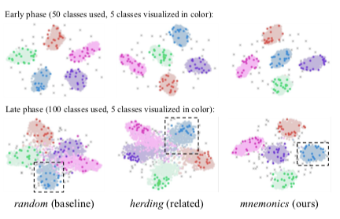

This optimization is done at the task end, once exemplars from new classes have been selected. The authors also choose to finetune the exemplars of old classes that have been selected in previous tasks. However, in this case, we don't have anymore a large amount of old classes' data to act as ground truth for the old classes exemplars optimization. Therefore, they split the exemplars set in half. One split is optimized using the second for ground truth and vice-versa.

The second contribution, and the major one, is unfortunately not very advertised in this paper. The authors re-use an idea from one of their previous papers in Meta-Learning. Instead of tuning all the ConvNet parameters for each task, they only slightly adapt them:  for each kernel, a small kernel of spatial dimensions equal to one is learned (likewise for the biases). This small kernel is expanded to the base kernel dimension and element-wise multiplied to it:

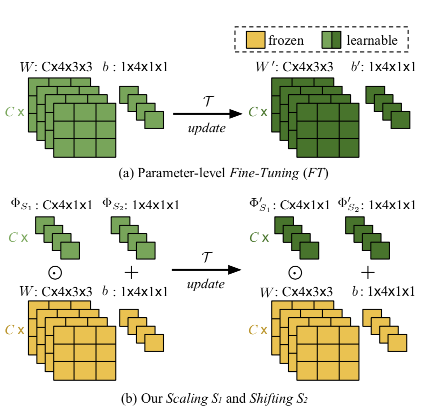

Intuitively, this method called "Meta-Transfer" does a small "shift & scaling". Most of the network is kept frozen and thus don't forget too much. The small adaptation enables the network to learn new classes.

They evaluated CIFAR100, ImageNet100, and ImageNet1000 in various settings and beat all previous SotA (especially *Hou et al., 2019* and *Wu et al., 2019*). In my recent paper ([Douillard et al., 2020](https://arxiv.org/abs/2004.13513)), our model PODNet outperforms their's in several settings and evaluate even on even longer incremental training.

## 10. Towards Backward-Compatible Representation Learning

**PDF**: [2003.11942](https://arxiv.org/abs/2003.11942)\\
**Authors**: Yantao Shen, Yuanjun Xiong, Wei Xia, Stefano Soatto

This paper is not directly related to Continual Learning but rather to Visual Search.  *Shen et al.* raise the issue of **backfilling**:

On a visual search model, embeddings of a large gallery have been computed once. Then given a query image,  we extract its features and compare them to the gallery features collection. For example, I take a picture of a shirt and want to know what are the most similar clothes available in a store.

A problem arises when a new model is trained. This model may be different from the previous one because the data is was trained on or because the architecture and losses were changed. The gallery features collection is not up-to-date anymore and we need to extract gain the features of the whole collection with the new model. This can be very costly when the gallery is made of billions of images.

The authors propose to make the features extractor "backward-compatible". It's mean that query features extracted by the new model are in the same latent space of the old model:

To produce a new model backward-compatible with a previous model that may be different, the authors add a loss over the classification loss:

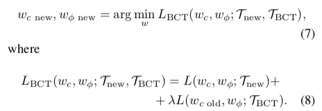

The first part of the loss update the new model on new $t$ dataset $T\_{\text{new}}$. For the second part, the best alternative proposed is training the old classifier $w\_{c\,\text{old}}$ with the new features extractor $w\_\theta$ on the new dataset $T\_\text{new} = T\_\text{BCT}$. Because the new dataset can contain new classes, the old classifier is extended with new weights. They are initialized with the mean features extracted by $w\_{\theta\, \text{old}}$ like Weight Imprinting did in Metric-Learning ([Qi et al., 2018](https://arxiv.org/abs/1712.07136)).

Overall, their model is still far from the upper-bound (recomputing the gallery with the new model) but they improve significantly over simple baselines and beat LwF ([Li & Hoiem, 2016](https://arxiv.org/abs/1606.09282)) by 3 points. I think this model is quite "simple" compared to SotA Continual Learning but it is interesting to see actual applications of the domain.

